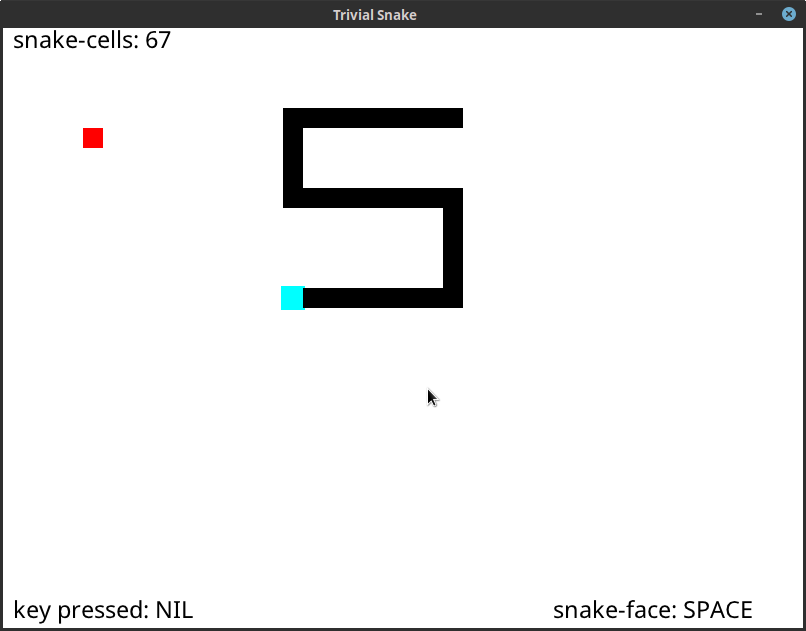

# trivial-snake

A trivial snake game written in Common Lisp built on top of [trivial-gamekit]. For learning purposes.



# Running

Make sure you have [SBCL], [quicklisp] and [trivial-gamekit] installed on your
system properly.

```
sbcl --load trivial-snake.lisp
```

Use arrow keys to move. Press space to pause. You only dies when
collides with itself.

[trivial-gamekit]: https://github.com/borodust/trivial-gamekit
[quicklisp]: https://www.quicklisp.org/beta/
[SBCL]: http://www.sbcl.org/
